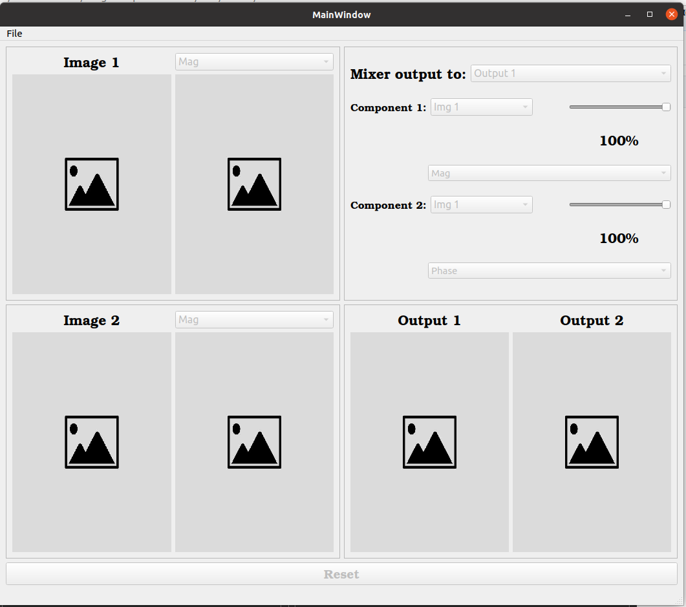
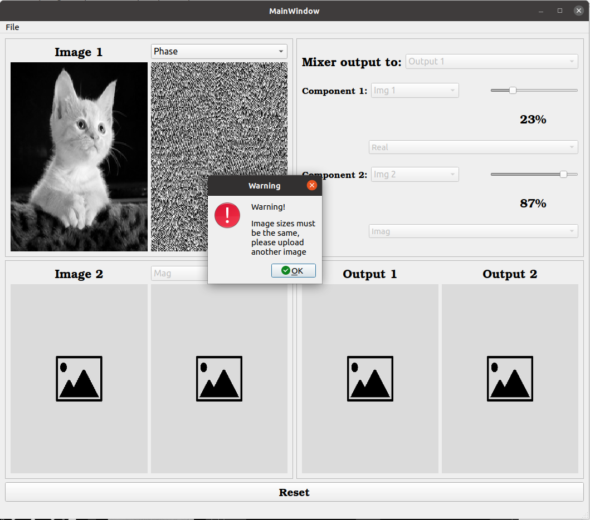
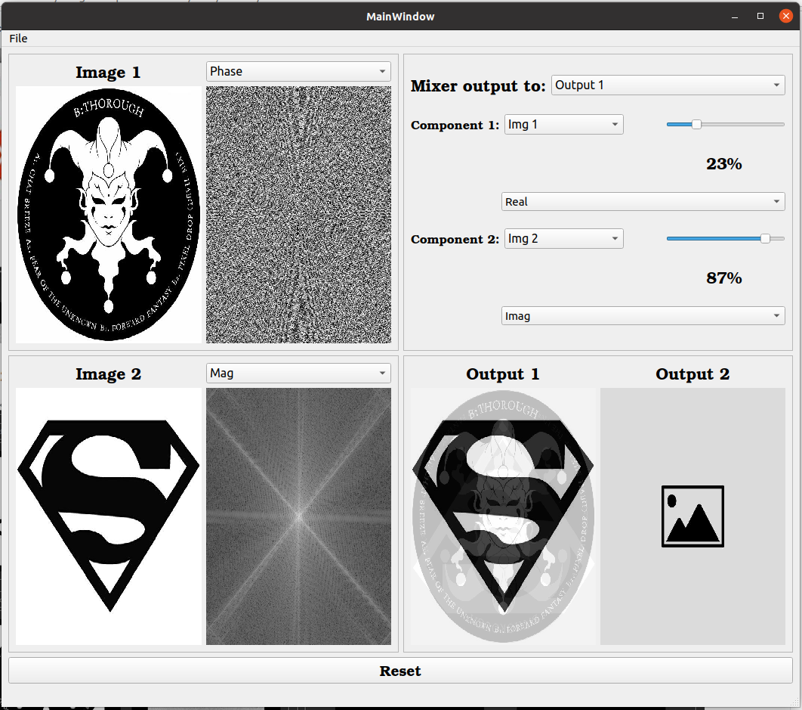
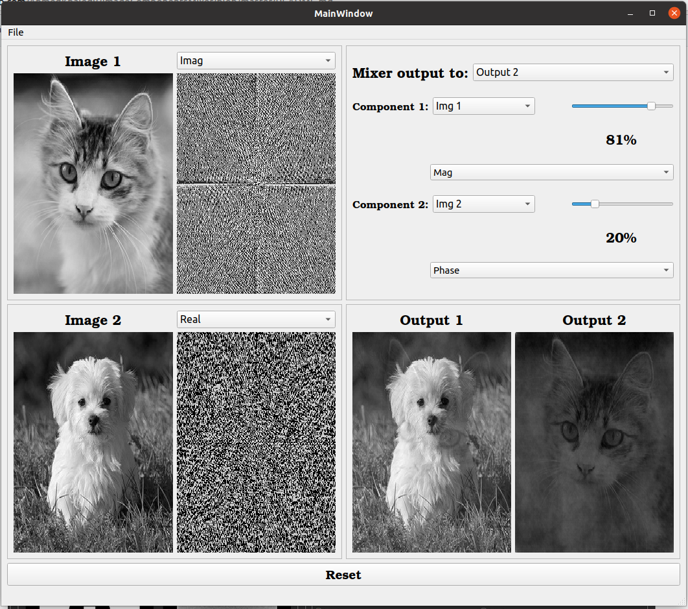

# Image mixer
------
###### Run `main_mixer.py` to run the GUI
* The software can show two images. For each image, the software should two displays one fixed display for the image, while the second display can show several components based on a drop-menu selection of 1) FT Magnitude, 2) FT Phase, 3) FT Real component, 4) FT Imaginary component.
 

* The two images have the same size. Otherwise, the software will give an error message.
 

* the software have a mixing panel in which the user can mix components of two images. Available components are: Magnitude, Phase, Real, Imaginary, uniform magnitude, uniform phase. the user can also determine the mixing ratio

 

 

* The software is coded using **Python** and **pyqt5** package for GUI.
